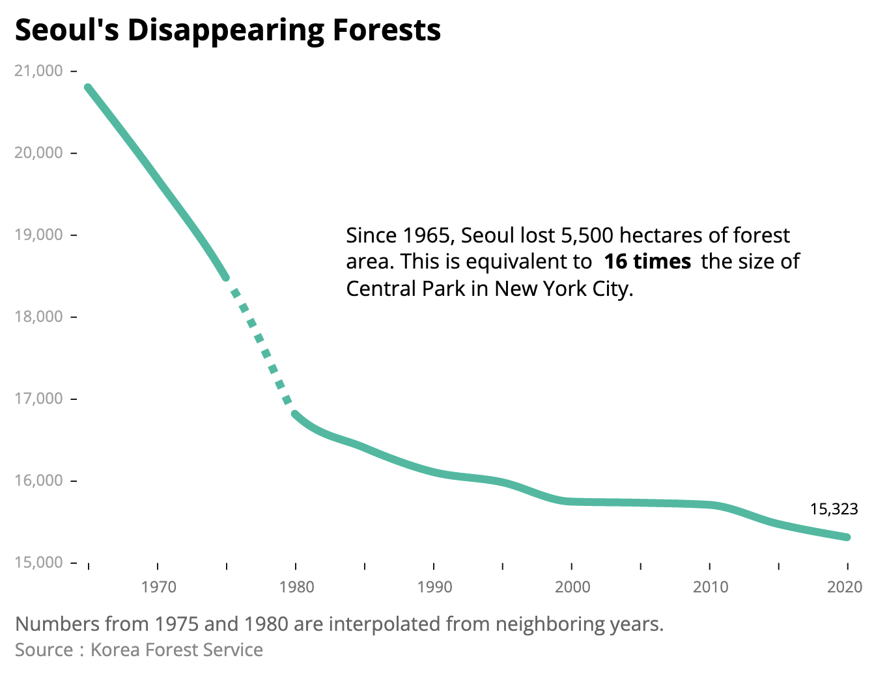

# Seoul's Disappearing Forests
Read the story here: [Seoul's Forested Oases Are Disappearing. Rampant Housing Development Is To Blame.](https://junekim6.github.io/seoul-forest-loss/).

## Overview
This project explores the history of Seoul's forest lands. By compiling available data, the story explains how more than 5,500 hectares of forest lands were destroyed due to housing development projects in the city. The story brings attention to the issue and provide insights and recommendations for preserving the remaining forests.

## Data Analysis and Reporting
The project includes data analysis of the forest land area and new housing development.
### Data Sources
- Seoul's forest area - [Korea Forest Service](https://english.forest.go.kr/)
- Number of new housing units in Seoul - [Korean Statistical Information Service](https://kosis.kr/eng/)
- Satellite images - [Google Earth](https://earth.google.com/web/)

### Methodology
- According to the Korea Forest Service, forest data prior to 1964 is unreliable as it was collected by regional administrations using different standards. There are also missing values in the database. The missing data was interpolated from neighboring years to create a cohesive graph, which is represented by a dashed line on the chart.

### Interviewees
- Han Bong-Ho, Professor at the University of Seoul School of Landscape Architecture
- Kim Jin-Tae, Avid hiker and member of a hiking club in Seoul.

## Folders
`data-analysis` folder includes all notebooks for data cleaning and exploratory visualizations.

## Tools Used
- Google Earth Pro
- Pandas
- ai2html
- Adobe Illustrator
- Adobe Lightroom
- DataWrapper
- Juxtapose JS

## Conclusion
The data from Korea Forest Service showed that Seoul has lost more than 5,500 hectares of forest area since 1965, a staggering loss of an area equivalent to 16 times of Central Park in New York City. 
Han Bong-Ho, a professor at University of Seoul, explained that without a revamp of housing policy and a curb on rising home prices, it is unlikely there will be a meaningful improvement in protecting Seoul's forests.
